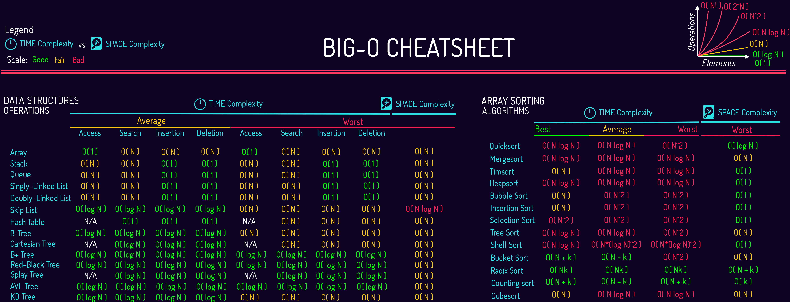
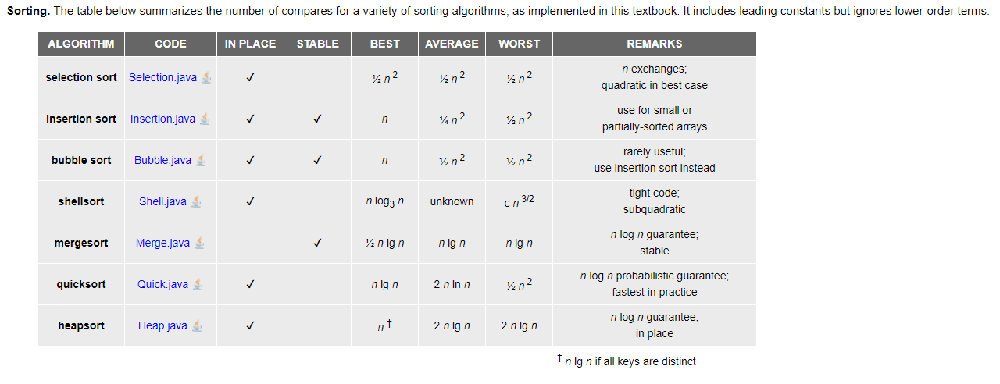

# Time and Space Complexity 

In Data Structures and Algorithms (DSA), there are several common time complexities that are used to describe the efficiency of an algorithm. 

Here are some of them: 
- Constant Time: O(1)
- Logarithmic Time: O(log n)
- Linear Time: O(n)
- Linear Logarithmic Time: O(n log n)
- Quadratic Time: O(n^2)
- Cubic Time: O(n^3)
- Exponential Time: O(2^n)
- Factorial Time: O(n!)

 

 

 

