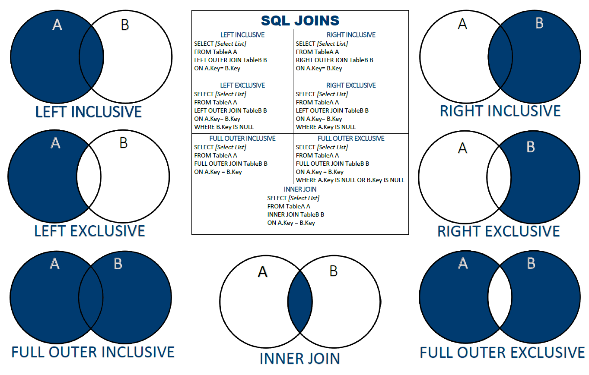

# SQL Documentation 

## Table of Contents 
1. [SQL Theory]()
2. [Creating Tables](#creating-tables)
3. [Modyfing Tables](#modifying-tables)
4. [SELECT statement](#select-statements)
5. [Conditional statements](#conditional-statement)
6. [Aggregation and Grouping]()
7. [Joins](#joins)
8. [Set Operations](#set-operations)
9. [Functions](#basic-functions)
10. [Window Functions](window-functions.md)
11. [Execution Hierarchy]()
 
## Resources : 
- [SQL-Basics.pdf](resources/sql-basics-cheat-sheet-a4.pdf)
- [SQL-Joins.pdf](resources/joins-cheat-sheet-a4.pdf)
- [SQL-Window-Functions.pdf](resources/Window_Functions_Cheat_Sheet.pdf)

<hr>

## Creating Tables
We use `CREATE TABLE` to create tables and specify data types and constraints for eact column.

```sql
CREATE TABLE table_name (
    col_name1 <data type> <PRIMARY KEY> <Constraints>,
    col_name2 <data type>,
    .
    .
    .
    col_namen <data type>
    PRIMARY KEY (<col name>)
);
```

We use `DESCRIBE` to see the table schema.

```sql
DESCRIBE table_name ; 
```

### Data Types 
We can use the following data types :
1.  `INT` : Whole Numbers
2.  `DECIMAL (M, N)` : Decimal Numbers
3.  `VARCHAR(I)` : String of text of length l
4.  `BLOB` : Binary Large Object, Stores large data
5.  `DATE` : 'YYYY-MM-DD'
6.  `TIMESTAMP` : 'YYYY-MM-DD HH:MM:SS'

### Constraints
We can use the following data types :
- `PRIMARY KEY` = NOT NULL + UNIQUE
- `FOREIGN KEY` <> REFRENCES <>
- `NOT NULL`
- `UNIQUE`
- `CHECK`
- `DEFAULT <SET NULL / CASCADE>`
- `ON DELETE` : action on foreign keys when the primary key row gets deleted
	- `SET NULL` - the value is set to NULL
	- `SET CASCADE` - the entire row is deleted
- `AUTO_INCREMENT` 
- `INDEX`

<hr>

## Modifying Tables 
- We use `ALTER` to modify schema ~ add/drop columns and change constraints/data types
- We use `INSERT` to add data to existing columns 
- We use `UPDATE` to change existing data 

### Droping Table
```sql
DROP TABLE table_name ;
```

### Modifying Schema 
```sql
--- adding column 
ALTER TABLE table_name 
ADD col_name <data type> ;

--- adding constraints
ALTER TABLE table_name 
ADD FOREIGN KEY (col_name) REFERENCES ( ) ;

--- droping column
ALTER TABLE table_name 
DROP col_name ;
```

### Inserting data 
```sql
--- insert new data into table
INSERT INTO table_name VALUES (
<value col 1>,
<value col 2>,
.
.
.
<value col n>,
) ;

--- insert new data into specific columns 
INSERT INTO <table name> <col names x, col names y> VALUES (
<value col x>,
<value col y>,
) ;
```

### Modifying data
```sql
UPDATE table_name
SET col_name1 = <value 1>, col_name2 = <value 2>
WHERE <condition> ;

--- updating data conditionally
UPDATE table_name
SET col_name = 
CASE 
    WHEN <condition> THEN <val> 
    WHEN <condition> THEN <val> 
    .
    .
    .
END ;
```
<hr>

## Select Statements 
We use `SELECT` to pull data from tables 

```sql
--- SELECT * to pull all columns  
SELECT <col_1> AS <alias> , <col_2>, . . . , <col_n> | table.col
FROM <table_1> AS <alias>
JOIN <table_2>
ON <table1.col> = <table2.col>
WHERE <condition>
GROUP BY col_names
HAVING <condition>
ORDER BY col_names <DESC>
LIMIT <OFFSET, ROW_COUNT>
OFFSET <>
;
```

Keywords that you should remember :
- `AS` : aliasing
- `DISTINCT` : can be use to fetch distinct values `SELECT DISTINCT <col name>`
- `LIKE` : used with wildcards
- `CASE WHEN <> THEN <> ELSE <> END AS <alias>`
<hr>

## Conditional Statement
We use `WHERE` and `HAVING` to filter tables. 

Difference between `WHERE` and `HAVING`: 
- `WHERE` clause places conditions on the selected columns (before group by) 
- `HAVING` clause places conditions on groups created by the GROUP BY clause (after group by)


```sql
SELECT <col names>
FROM <table 1> AS <alias>
JOIN <table 2>
ON <table1.col> = <table2.col>
--- WHERE statement used to filter on table before grouped columns 
WHERE <condition>
GROUP BY <col names>
--- HAVING statement used to filter on grouped columns 
HAVING <condition>
ORDER BY <col names> <DESC>
LIMIT <OFFSET, ROW COUNT>
OFFSET <>
;
```

### Conditions :
- Operators : `= , <> / !=, >, <, >=, <=`
- `NOT, OR, AND` (AND operator is evaluated first)
- col_name `IN` (val1, val2, . . . valn)
- col_name `IS NULL` / `IS NOT NULL`
- col_name `BETWEEN <val1> AND <val2>` **(inclusive)**
- col_name `LIKE "..."` (wildcard used)
- col_name `REGEXP '...'`

### Regular Expression 
- `^` : beginning of string
- `$` : end of string
- `|` : OR
- `[a-h]` : any one of the characters from a to h

### Wildcards :
- Used with `LIKE`
- `%` : any number of characters   
- `_`: one character (can use multiple to denote specific number)
<hr>

### Aggregation and Grouping
`GROUP BY` groups together rows that have the same values in specified columns. It computes summaries (aggregates) for each unique combination of values. 

**Note** : The number of rows are reduced due to the group by clause. Window function also operate on subset of rows but do not reduce the number of rows

[Aggregation Functions](#aggregation-functions)

## Joins



```sql
--- explicit joins
SELECT <col names> 
FROM <table1>
<INNER, LEFT, RIGHT, FULL, CROSS> JOIN <table2>
ON <table1.col> = <table2.col>
;

--- implicit / corss joins
SELECT <col names> 
FROM <table1>, <table2>
;

```

### Type of joins : 
1. `JOIN` / `INNER JOIN` - only rows with common key
2. `LEFT JOIN` / LEFT OUTER JOIN
3. `RIGHT JOIN` / RIGHT OUTER JOIN
4. `FULL JOIN` / FULL OUTTER JOIN 
   - union of left and right joins
5. `CROSS JOIN` 
   - combination of all rows 
   - an implicit join with no WHERE condition = CROSS JOIN
6. `NATURAL JOIN` 
   - Produces unexpected results - don’t use

Types : 
- SELF JOIN - joining table with itself
- NON-EQUI SELF JOIN - when you usenon-equality in the `ON` condition
    ```sql 
    SELECT
    a.toy_name AS toy_a,
    b.toy_name AS toy_b
    FROM toy a
    JOIN toy b
    ON a.cat_id < b.cat_id;
    ```
- MULTIPLE JOINS : basic just joining multiple times
- <font color='pink'>JOIN WITH MULTIPLE CONDITIONS</font> / COMPOUND CONDITIONS
    ```sql
    SELECT
    cat_name,
    o.name AS owner_name,
    c.age  AS cat_age,
    o.age  AS owner_age
    FROM cat c
    JOIN owner o
    ON c.owner_id = o.id
    AND c.age < o.age;
    ```

Notes :
- Join tables both horizontally and vertically 
- Can alias table without AS also
- Implicit and Explicit JOINs 	
- - `USING` clause : when the column name are same for the 2 tables we can use `USING col_name` instead of `ON table1.col_name = table2.col_name`
    ```sql
    SELECT <> 
    FROM <table 1>
    JOIN <table 2>
    USING ( <col name> )
    ```
<hr>

## Set operations 

`UNION` Operation :
- A OR B
- combine queries 
- creates a vertical stack 
- query output should have same number of columns (and data type) 
- name of the column depends on first query 
- `UNION` vs `UNION ALL` : 
  - `UNION` - removes duplicate rows
  - `UNION ALL` - does not removes duplicate rows

`INTERSECT` Operation :
- A AND B
- returns only rows that appear in both result sets

`EXCEPT` / `MINUS` Operation :
- A - B
- returns only the rows that appear in the first result set but do not appear in the second result set.

```sql
SELECT <col name> 
FROM <table name>
UNION 
SELECT <col name> 
FROM <table name> 
. . .
UNION / INTERSECT / EXCEPT
. . .
<more queries> 
; 
```
<hr>

## Basic Functions 

### Functions 
- `IFNULL (col name, default value)` 
- `COALESCE ( )` - returns first non-null value
- `FORMAT ( )`
- `DATE_TRUNC ( )` 
- Number Functions : 
  - `ROUND (col_name, precision) `
- String Functions : 
  - `LEFT (string, char)` 
  - `RIGHT (string, char)`


### Aggregation Functions
- `COUNT ( )` : count the number of values (not unique values)
- `SUM ( )`
- `AVG ( )` 
- `MIN ( )` 
- `MAX ( )`

<hr>


